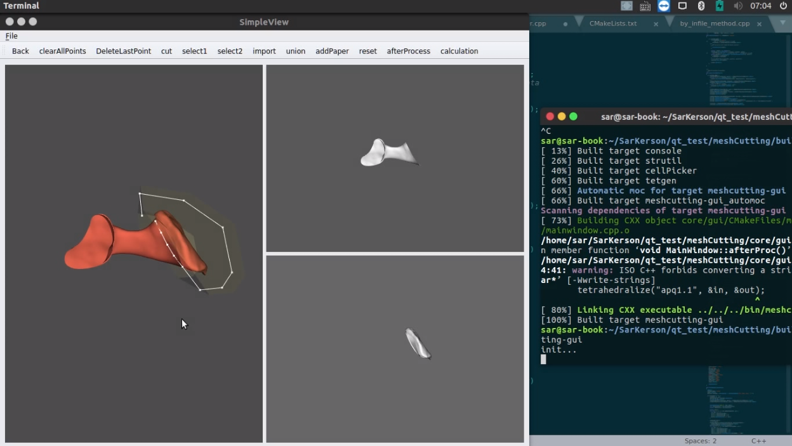

# MESHCUTTING
------

该软件主要用于，对导入的三维网格模型进行简单多边形切割操作；并可以与导入的三维网格进行合并生成新的三维网格模型的操作，总结起来有以下功能：

> * 简单多边形切割
> * 三维网格位移、缩放、旋转
> * 三维网格的合并
> * 保存已操作的三维网格

## 按键说明 

| 按键        | 说明   |
| :--------:  | :-----:  | 
| Back     | 撤销 | 
| clearAllPoints        |   删除已画所有点   |  
| DeleteLastPoint        |    删除上一个点    |
|cut|切割|
|select1|选择窗口1的网格|
|select2|选择窗口2的网格|
|import|导入要合并的网格模型|
|union|合并|
|addPaper|网格外画点，添加着点平面|
|reset|重置界面|


|快捷键|说明|
| :--------:  | :-----:  |
|1|相机视角|
|2|物体视角|
|,|缩小|
|.|放大|
|n|对应cut|


## 流程说明:

```flow
st=>start: Start
open=>operation: 打开stl文件(菜单栏)
addpoint1=>operation: 网格上绘制切割区域(鼠标左键)
inmesh=>condition: 是否网格外画点？
addpoint2=>operation: 网格上绘制切割区域(鼠标左键)
paper=>operation: 添加paper(addPaper)
epoint=>operation: 结束画点
cut=>operation: 切割按钮(cut: 快捷键'n')
select=>operation: 选择切割好的模型(select1:选择窗口1, select2:选择窗口2)
ccut=>condition: 完成切割？
import=>operation: 导入stl文件(import)
trans=>operation: 调整导入模型(相机视角:快捷键'1'; 物体视角:快捷键'2'; 缩放:快捷键',''.'; 移动:鼠标中键)
union=>operation: 合并三维网格(union)
save=>operation: 保存为stl文件(菜单栏)
e=>end

st->open->addpoint1->inmesh
inmesh(yes)->addpoint2->epoint->cut->select->ccut
inmesh(no)->paper->addpoint1
ccut(no)->addpoint1
ccut(yes)->import->trans->union->save->e
```
**自定义多边形切割示例**

